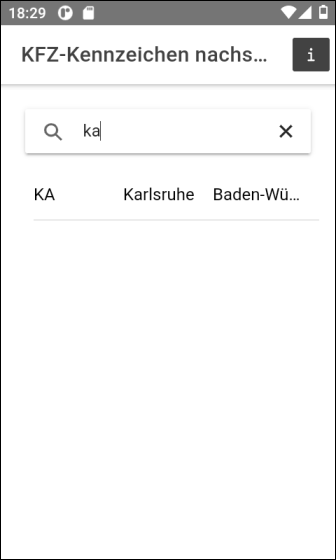

# Ionic app to query county/city codes of car number plates in Germany #

<br>

Simple Ionic app to demonstrate usage of UI compoment [ion-searchbar](https://ionicframework.com/docs/api/searchbar).

<br>

Run the following command to update the version/timestamp shown in the info modal of the application:
```
npm run bump-version
```

<br>

----

## Screenshots ##

<br>

 &nbsp;  



<br>

----

## License ##

<br>

See the [LICENSE file](LICENSE.md) for license rights and limitations (BSD 3-Clause License) for the files in this repository.

<br>
